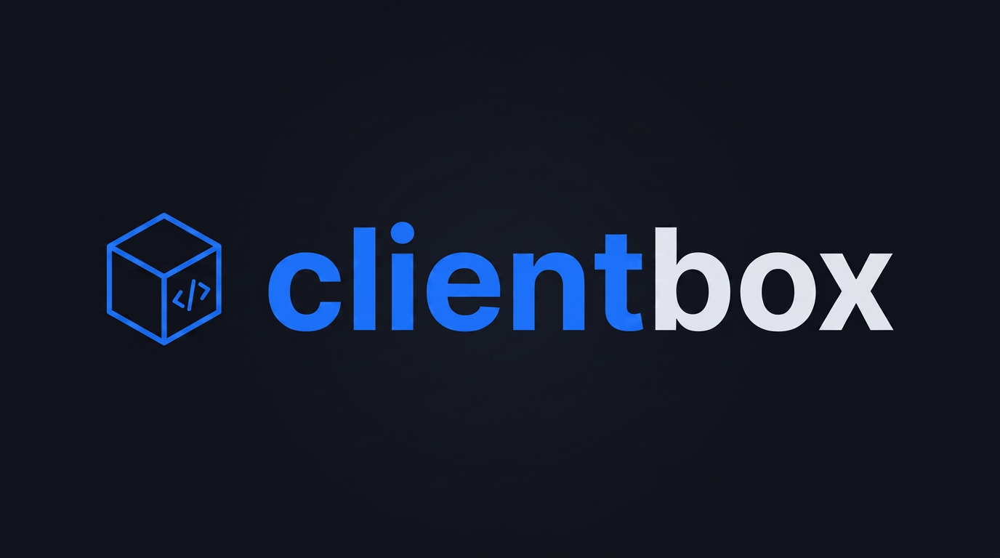

<p align="center">
  
</p>

<h1 align="center">clientbox</h1>

<p align="center">
  Pure client-side, in-browser code execution engine.<br>
  Run JavaScript, TypeScript, Python, HTML/CSS/JS, C#, Java, PHP, Dart, and Go entirely in the browser with zero backend.
</p>

<p align="center">
  <a href="https://yaman-cyber.github.io/clientbox/"><strong>Live Demo &rarr; yaman-cyber.github.io/clientbox</strong></a>
</p>

<p align="center">
  <a href="https://www.npmjs.com/package/clientbox"></a>
  <a href="https://www.npmjs.com/package/clientbox"></a>
  <a href="https://github.com/Yaman-cyber/clientbox/blob/main/LICENSE"></a>
  <a href="https://yaman-cyber.github.io/clientbox/"></a>
</p>

---

## Install

```bash
npm install clientbox
```

## Quick start

```ts
import { ClientBox } from 'clientbox';

const box = new ClientBox();

const result = await box.run('node', {
  files: { '/index.js': 'console.log("Hello from clientbox!")' },
  entryPoint: '/index.js',
});

console.log(result.stdout); // "Hello from clientbox!"

box.destroy();
```

## Supported languages

| Language     | Key          | Runtime                              |
| ------------ | ------------ | ------------------------------------ |
| JavaScript   | `node`       | Web Worker + virtual FS              |
| TypeScript   | `node`       | Web Worker + type-stripping          |
| Python       | `python`     | Pyodide (CDN, ~12 MB first load)     |
| HTML/CSS/JS  | `web`        | Sandboxed iframe                     |
| C#           | `csharp`     | Transpiler (C#-to-JS in iframe)      |
| Java         | `java`       | CheerpJ (CDN) + transpiler fallback  |
| PHP          | `php`        | Transpiler (PHP-to-JS in iframe)     |
| Dart         | `dart`       | Transpiler (Dart-to-JS in iframe)    |
| Go           | `go`         | Transpiler (Go-to-JS in iframe)      |

## Usage examples

### JavaScript (Node-style)

Multi-file with `require`:

```ts
const result = await box.run('node', {
  files: {
    '/index.js': `
      const { greet } = require('./utils');
      console.log(greet('world'));
    `,
    '/utils.js': `
      module.exports = {
        greet: (name) => \`Hello, \${name}!\`,
      };
    `,
  },
  entryPoint: '/index.js',
});
// stdout: "Hello, world!"
```

ESM imports are also supported:

```ts
const result = await box.run('node', {
  files: {
    '/index.js': `
      import { add } from './math.js';
      console.log(add(2, 3));
    `,
    '/math.js': `
      export const add = (a, b) => a + b;
    `,
  },
  entryPoint: '/index.js',
});
// stdout: "5"
```

### Python

```ts
const result = await box.run('python', {
  files: {
    '/main.py': `
import utils

for i in range(5):
    print(utils.square(i))
    `,
    '/utils.py': `
def square(n):
    return n * n
    `,
  },
  entryPoint: '/main.py',
});
// stdout: "0\n1\n4\n9\n16"
```

### HTML/CSS/JS (Web)

```ts
const result = await box.run('web', {
  files: {
    '/index.html': `
      <!DOCTYPE html>
      <html>
        <head><link rel="stylesheet" href="style.css"></head>
        <body>
          <h1>Hello</h1>
          <script src="app.js"></script>
        </body>
      </html>
    `,
    '/style.css': 'h1 { color: blue; }',
    '/app.js': 'console.log("page loaded");',
  },
  entryPoint: '/index.html',
});
// stdout: "page loaded"
```

### C#

```ts
const result = await box.run('csharp', {
  files: {
    '/Program.cs': `
using System;

class Program
{
    static void Main(string[] args)
    {
        Console.WriteLine("Hello from C#!");
        for (int i = 0; i < 5; i++)
        {
            Console.WriteLine($"i = {i}");
        }
    }
}
    `,
  },
  entryPoint: '/Program.cs',
});
// stdout: "Hello from C#!\ni = 0\ni = 1\ni = 2\ni = 3\ni = 4"
```

### Java

```ts
const result = await box.run('java', {
  files: {
    '/Main.java': `
public class Main {
    public static void main(String[] args) {
        System.out.println("Hello from Java!");
        for (int i = 0; i < 5; i++) {
            System.out.println("i = " + i);
        }
    }
}
    `,
  },
  entryPoint: '/Main.java',
});
// stdout: "Hello from Java!\ni = 0\ni = 1\ni = 2\ni = 3\ni = 4"
```

### PHP

```ts
const result = await box.run('php', {
  files: {
    '/index.php': `
<?php
function factorial($n) {
    if ($n <= 1) return 1;
    return $n * factorial($n - 1);
}

echo "Hello from PHP!\\n";
for ($i = 1; $i <= 5; $i++) {
    echo "Factorial of $i = " . factorial($i) . "\\n";
}
?>
    `,
  },
  entryPoint: '/index.php',
});
// stdout: "Hello from PHP!\nFactorial of 1 = 1\n..."
```

### Dart

```ts
const result = await box.run('dart', {
  files: {
    '/main.dart': `
void main() {
  print('Hello from Dart!');
  for (int i = 1; i <= 5; i++) {
    print('Fibonacci(\$i) = \${fib(i)}');
  }
}

int fib(int n) {
  if (n <= 1) return n;
  return fib(n - 1) + fib(n - 2);
}
    `,
  },
  entryPoint: '/main.dart',
});
// stdout: "Hello from Dart!\nFibonacci(1) = 1\n..."
```

### Go

```ts
const result = await box.run('go', {
  files: {
    '/main.go': `
package main

import "fmt"

func main() {
    for i := 1; i <= 5; i++ {
        fmt.Printf("%d! = %d\\n", i, factorial(i))
    }
}

func factorial(n int) int {
    if n <= 1 { return 1 }
    return n * factorial(n-1)
}
    `,
  },
  entryPoint: '/main.go',
});
// stdout: "1! = 1\n2! = 2\n3! = 6\n4! = 24\n5! = 120"
```

## Live demo

Try the interactive playground at **[yaman-cyber.github.io/clientbox](https://yaman-cyber.github.io/clientbox/)** -- no install required, runs entirely in your browser.

## API reference

### `new ClientBox(config?)`

Create a new execution engine instance.

```ts
interface ClientBoxConfig {
  timeout?: number;           // Default execution timeout (ms). Default: 30000
  pyodideCdnUrl?: string;     // Override Pyodide CDN base URL
  cheerpjCdnUrl?: string;     // Override CheerpJ loader script URL
  dotnetCdnUrl?: string;      // Override .NET WASM CDN base URL
  onStatusChange?: (event: StatusEvent) => void;
}
```

### `box.run(language, options)`

Execute code and return the result.

```ts
type Language = 'node' | 'python' | 'web' | 'csharp' | 'java' | 'php' | 'dart' | 'go';

interface RunOptions {
  files: Record<string, string>;  // Virtual file path -> content
  entryPoint: string;             // File to execute
  stdin?: string;                 // Optional stdin
  timeout?: number;               // Override timeout for this run
}

interface RunResult {
  stdout: string;     // Captured standard output
  stderr: string;     // Captured standard error
  error: string | null;
  exitCode: number;   // 0 = success
  duration: number;   // Wall-clock ms
}
```

### `box.destroy()`

Tear down all workers and iframes. The instance cannot be reused after this.

## Framework integration

`clientbox` is a zero-dependency TypeScript library that works with any framework or vanilla JS.

### React / Next.js

```tsx
'use client';
import { useCallback, useRef } from 'react';
import { ClientBox } from 'clientbox';

export function CodeRunner() {
  const boxRef = useRef<ClientBox | null>(null);

  const runCode = useCallback(async () => {
    if (!boxRef.current) boxRef.current = new ClientBox();
    const result = await boxRef.current.run('node', {
      files: { '/index.js': 'console.log("hello")' },
      entryPoint: '/index.js',
    });
    console.log(result.stdout);
  }, []);

  return <button onClick={runCode}>Run</button>;
}
```

### Vue

```vue
<script setup lang="ts">
import { ref, onUnmounted } from 'vue';
import { ClientBox } from 'clientbox';

const box = new ClientBox();
const output = ref('');

async function run() {
  const result = await box.run('python', {
    files: { '/main.py': 'print("Hello from Python!")' },
    entryPoint: '/main.py',
  });
  output.value = result.stdout;
}

onUnmounted(() => box.destroy());
</script>

<template>
  <button @click="run">Run Python</button>
  <pre>{{ output }}</pre>
</template>
```

### Svelte

```svelte
<script lang="ts">
  import { ClientBox } from 'clientbox';
  import { onDestroy } from 'svelte';

  const box = new ClientBox();
  let output = '';

  async function run() {
    const result = await box.run('node', {
      files: { '/index.js': 'console.log(2 + 2)' },
      entryPoint: '/index.js',
    });
    output = result.stdout;
  }

  onDestroy(() => box.destroy());
</script>

<button on:click={run}>Run</button>
<pre>{output}</pre>
```

## How it works

| Language | Execution strategy |
| -------- | ------------------------------------------- |
| `node`   | Web Worker with patched `console`, custom `require()`, ESM `import`, and in-memory virtual FS. TypeScript files are type-stripped before execution. |
| `python` | Pyodide (CPython compiled to WebAssembly) running in a Web Worker. Loaded from CDN on first use (~12 MB). |
| `web`    | Sandboxed `<iframe>` with `sandbox="allow-scripts"`. CSS/JS files are inlined via blob URLs. |
| `csharp` | Iframe harness that transpiles C# to JS. Handles Console.WriteLine, string interpolation, foreach, multi-file class resolution, and more. |
| `java`   | Iframe with CheerpJ (WebAssembly JVM) from CDN + transpiler fallback. Handles System.out, typed variables, for-each, multi-class projects. |
| `php`    | Iframe harness that transpiles PHP to JS. Supports echo, `$variables`, string concatenation, foreach, arrays, and common stdlib functions. |
| `dart`   | Iframe harness that transpiles Dart to JS. Supports print, string interpolation, typed variables, collections, and function declarations. |
| `go`     | Iframe harness that transpiles Go to JS. Supports fmt.Print/Println/Printf, for/range loops, slices, maps, multi-file packages, and stdlib stubs. |

Runtimes for Python and Java are loaded lazily from CDN only when first needed. All other runners require no external downloads.

## SSR safety

The package can be safely imported in server-side environments (Next.js, Nuxt, SvelteKit SSR). All browser APIs are only accessed when `run()` is called. If `run()` is called outside a browser, a clear error is thrown.

## License

MIT
